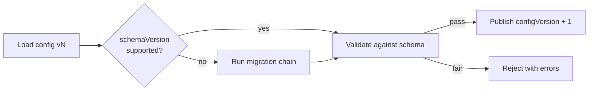

# Migration Strategy

How tenant configurations migrate between schema versions.

## Principles

1. **Never mutate published configs in place** — migrations produce a new config version
2. **Every migration is a pure function** — `(oldConfig, context) → newConfig`
3. **Migrations are idempotent** — running twice produces the same result
4. **Migrations are audited** — recorded in `meta.migrationHistory`
5. **Rollback is config-version based** — not migration reversal

## Migration Pipeline



## Migration Script Contract

Each migration script lives in:

```
schemas/tenant-config/v1/migrations/   ← migrations FROM v1 TO v2
schemas/tenant-config/v2/migrations/   ← migrations FROM v2 TO v3
```

Script interface (future `tooling/config-linter` / Config Engine):

```typescript
interface SchemaMigration {
  id: string; // e.g. 'v1-to-v2-rename-featureFlags'
  fromVersion: 'v1';
  toVersion: 'v2';
  description: string;
  up: (config: unknown) => unknown;
  down?: (config: unknown) => unknown; // optional, for dev/staging only
}
```

## Planned v1 → v2 Example (Illustrative)

When v2 is needed, a migration might:

| Change                                     | Migration Action                        |
| ------------------------------------------ | --------------------------------------- |
| Rename `featureFlags` → `features`         | Copy key, delete old key                |
| Split `payments.gateways` into plugin refs | Map inline array to plugin registry IDs |
| Add required `tenant.dataRegion`           | Inject default from tenant country      |

## Execution Order

For a config at schema v1 migrating to v3:

```
v1 → v2 (migration v1-to-v2-*) → v2 → v3 (migration v2-to-v3-*)
```

Migrations run sequentially. Each step validates against its target schema before proceeding.

## Safety Guardrails

| Guardrail           | Description                                                          |
| ------------------- | -------------------------------------------------------------------- |
| **Dry run**         | Preview migrated config without publishing                           |
| **Diff report**     | Show JSON diff before/after migration                                |
| **Validation gate** | Target schema Zod/JSON Schema validation must pass                   |
| **Locked fields**   | `aiSettings.guardrails.lockedFields` are never modified by migration |
| **Backup**          | Previous config version retained in config_versions store            |

## Rollback Strategy

Schema migration rollback does **not** reverse migrations. Instead:

1. Config Engine stores immutable config versions
2. Operator selects a previous `configVersion` to republish
3. `meta.schemaVersion` of the old config must still be supported

If an old schema version is deprecated, configs on that version must be migrated forward before republish.

## Current Status (v1)

No migrations required — v1 is the initial schema.

Migration infrastructure will be implemented in:

- `tooling/config-linter` — dry-run migration + validation
- `platform/config-engine` — publish-time migration orchestration

Directory placeholder: `schemas/tenant-config/v1/migrations/`

## Testing Migrations (Future)

Each migration must include:

- Unit test with before/after fixture JSON
- Validation test against target schema version
- Idempotency test (run `up` twice, same result)
