# Schema Cross-References

How configuration JSON Schemas compose and reference each other.

## Reference Model

All schemas use **JSON Schema Draft 2020-12** with:

- **`$id`** — canonical URI under `https://platform.ai-commerce.dev/schemas/`
- **`$ref`** — relative file paths for cross-schema composition
- **`$defs`** — reusable sub-schemas within a file

## Dependency Graph

```mermaid
flowchart TB
    ROOT[tenant-config.schema.json]

    ROOT --> META[meta.schema.json]
    ROOT --> TENANT[tenant.schema.json]
    ROOT --> COMPANY[company.schema.json]
    ROOT --> BRANDING[branding.schema.json]
    ROOT --> THEME[theme/v1/theme.schema.json]
    ROOT --> NAV[navigation/v1/navigation.schema.json]
    ROOT --> LANG[languages.schema.json]
    ROOT --> CUR[currency.schema.json]
    ROOT --> FF[feature-flags.schema.json]
    ROOT --> AUTH[authentication.schema.json]
    ROOT --> PAY[payments.schema.json]
    ROOT --> NOTIF[notifications.schema.json]
    ROOT --> INT[integrations.schema.json]
    ROOT --> AI[ai-settings.schema.json]
    ROOT --> MOB[mobile-app-settings.schema.json]
    ROOT --> WEB[web-store-settings.schema.json]
    ROOT --> ADM[admin-dashboard-settings.schema.json]
    ROOT --> ENV[environment-settings.schema.json]

    META --> VER[shared/v1/versioning.schema.json]
    META --> COM[shared/v1/common.schema.json]
    TENANT --> COM
    COMPANY --> COM
    BRANDING --> COM
    THEME --> COM
    LANG --> COM
    CUR --> COM
    PAY --> COM
    INT --> COM
    MOB --> COM
    WEB --> COM
    VER --> COM
```



## Shared Schemas

| Schema         | Path                               | Purpose                                                         |
| -------------- | ---------------------------------- | --------------------------------------------------------------- |
| **Common**     | `shared/v1/common.schema.json`     | Primitives: UUID, slug, locale, currency, URL, email, hex color |
| **Versioning** | `shared/v1/versioning.schema.json` | `schemaVersion`, `configVersion`, migration records             |

Every domain schema references `$defs` from **common** for consistent validation.

## Root Document

`tenant-config/v1/tenant-config.schema.json` is the **root entry point**. It:

1. Declares all required top-level sections
2. Sets `additionalProperties: false` to reject unknown keys
3. Delegates validation to domain schemas via `$ref`

```json
{
  "theme": { "$ref": "../../theme/v1/theme.schema.json" },
  "navigation": { "$ref": "../../navigation/v1/navigation.schema.json" },
  "tenant": { "$ref": "./tenant.schema.json" }
}
```

## Cross-Domain References

| From                                   | To                                            | Mechanism                                 |
| -------------------------------------- | --------------------------------------------- | ----------------------------------------- |
| `meta.schemaVersion`                   | `versioning.schema.json#/$defs/schemaVersion` | `$ref`                                    |
| `tenant.defaultLocale`                 | `common.schema.json#/$defs/localeCode`        | `$ref`                                    |
| `branding.logo.primary`                | `common.schema.json#/$defs/url`               | `$ref`                                    |
| `navigation.web.primary[].featureFlag` | `feature-flags.flags` keys                    | **Convention** (string key, not `$ref`)   |
| `aiSettings.guardrails.lockedFields`   | Any config path                               | **Convention** (JSON Pointer paths)       |
| `environment.overrides`                | Partial domain schemas                        | **Open object** with known property hints |

**Convention-based links** are documented but not enforced via `$ref` because they are runtime resolution rules, not structural schema composition.

## External Schema Domains

Theme and Navigation live in dedicated schema folders (reusable outside tenant config):

- `schemas/theme/v1/` — consumed by Theme Engine
- `schemas/navigation/v1/` — consumed by all generated app surfaces

They are embedded in the root tenant config by reference, not duplication.

## Code Generation

`@ai-commerce/config-schema` bundles all `$ref` chains before generating:

- **TypeScript interfaces** — `json-schema-to-typescript`
- **Zod validators** — `json-schema-to-zod` on bundled schema

Run: `pnpm --filter @ai-commerce/config-schema generate`
